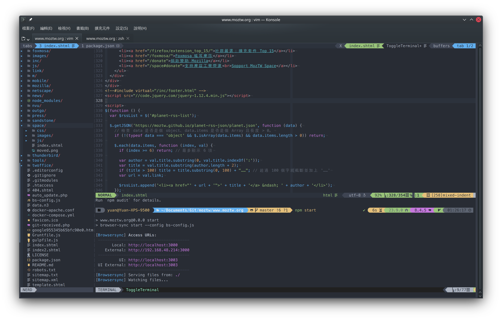

Yuan dotfile 自用環境設定檔
================================================================================
來放個調了很久的做事環境... 其實是最近有轉移多臺電腦的需求😅，想說就把我的設定整理起來，之後換電腦換機器的時候，我習慣的環境可以方便一點這樣帶著走🚗。




主要是chezmoi用來統整這些dotfiles檔案，常用作業系統是Manjaro (Arch Linux) 和 macOS，有針對這兩個作業系統調整過了，也寫好Script盡量可以一兩行指令直接懶人安裝到好。

目前比較著重在vim和zsh，有稍微調過GVim和Alacritty、Konsole設定，還有zsh和git幾個我常用的alias，也有處理過在終端機界面顯示圖片的支援（不過實際上會用到的軟體實在不多😅）。

不用期望這邊會有完整的說明啦，基本上還是自用為主，這份repo其實主要目的還是給自己方便把環境帶著走，順便把能公開的部份整理好在這邊公開，順便寫一下Readme來克服健忘症的自己😛。

（當然不能公開的密碼、主機名單...我還是有用chezmoi整理，就另外開Private Repo來放了）。

安裝
--------------------------------------------------------------------------------
### Linux / macOS
#### 安裝主dotfiles包
```
sh -c "$(curl -fsLS get.chezmoi.io)" -- init --apply chyuaner
```

這一行指令將會把我的設定載下來複製到相對應的位置以外，還會自動安裝需要的相關軟體、套件，基本上盡量簡化到開箱即用。（不過我只有親測Manjaro Linux與macOS，其他作業系統請自行看 `.chezmoidata/packages.toml` 套件名單自行手動處理。）

<details>
  <summary>我自己自用的安裝方式</summary>

##### 1. 放置自己的金鑰（若是其他人要用，請直接跳過）
將 `id_rsa` sshkey金鑰檔放到 `~/.ssh/id_rsa`

##### 2. 安裝主dotfiles包
```
sh -c "$(curl -fsLS get.chezmoi.io)" -- init ssh://git@git.yuaner.tw:10022/yuan/dotfiles.git --apply
```

##### 3. 安裝私人用的dotfiles包（若是其他人要用，請直接跳過）
```
chezmoi init --source ~/.local/share/chezmoi-private --config ~/.config/chezmoi-private/chezmoi.toml ssh://git@git.yuaner.tw:10022/yuan/dotfiles-private.git --apply
chezmoi apply
```
</details>

#### 若需要刪掉重來
```
rm -rf ~/.local/share/chezmoi
rm -rf ~/.local/share/chezmoi-private
```

可能會需要刪掉相關設定
```
rm ~/.ssh/known_hosts
rm -rf ~/.vimrc ~/.vim ~/.gvimrc
rm ~/.zshrc
rm -rf ~/.config/alacritty ~/.config/zellij 
```

<details>
  <summary>依照chezmoi官方教學</summary>
  
  #### Quick start
  With chezmoi, pronounced /ʃeɪ mwa/ (shay-mwa), you can install chezmoi and your dotfiles from your GitHub dotfiles repo on a new, empty machine with asingle command:

  ```
  sh -c "$(curl -fsLS get.chezmoi.io)" -- init --apply ssh://git@git.yuaner.tw:10022/yuan/dotfiles.git
  ```

  As well as the curl | sh installation, you can install chezmoi with your favorite package manager.

  Updating your dotfiles on any machine is a single command:

  ```
  chezmoi update
  ```

  chezmoi runs on all popular operating systems, is distributed as a single statically-linked binary with no dependencies, and does not require root access.

  #### Set up a new machine with a single command

  You can install your dotfiles on new machine with a single command:

  ```
  chezmoi init --apply ssh://git@git.yuaner.tw:10022/yuan/dotfiles.git
  ```

  #### To force a refresh the downloaded archives
  use the --refresh-externals flag to chezmoi apply:

  ```
  chezmoi --refresh-externals apply
  ```

  `--refresh-externals` can be shortened to `-R`:

  ```
  chezmoi -R apply
  ```

</details>


chezmoi基本用法
--------------------------------------------------------------------------------
### 進入資料夾
```
chezmoi cd
```

### 加入檔案 (或從家目錄裡實際運作檔案內容更新)
```
chezmoi add ~/.zshrc
```

### 編輯檔案
```
EDITOR="code" chezmoi edit ~/.zshrc
chezmoi apply ~/.zshrc
```

#### 套用全部
```
chezmoi apply
```

zsh
--------------------------------------------------------------------------------

### 有用到的套件
* colorls
* eza
* sixel

### 基本快速鍵
* `alt+e`: 🪄開啟檔案總管快速鍵
* `ctrl+l`: 清空螢幕
* `ctrl+u`: 刪除一整行
* `ctrl+w`: 刪除一個單字


### zinit 套件管理程式

#### 更新所有套件
```
# Self update
zinit self-update

# Plugin update
zinit update
```

vim
--------------------------------------------------------------------------------

### 第一次啟動請先下以下指令

#### macOS
```
sudo ln -sfn $(brew --prefix java)/libexec/openjdk.jdk /Library/Java/JavaVirtualMachines/openjdk.jdk
vim +PlugInstall  +qall
```

#### Windows (PowerShell)
```
winget install -e GoLang.Go OpenJS.NodeJS
mkdir -p vimfiles\autoload
Invoke-WebRequest -Uri "https://raw.githubusercontent.com/junegunn/vim-plug/master/plug.vim" -OutFile "vimfiles\autoload\plug.vim"
```

Konsole
--------------------------------------------------------------------------------
相關檔案位置：

* dot_config/private_konsolerc
* dot_local/share/konsole