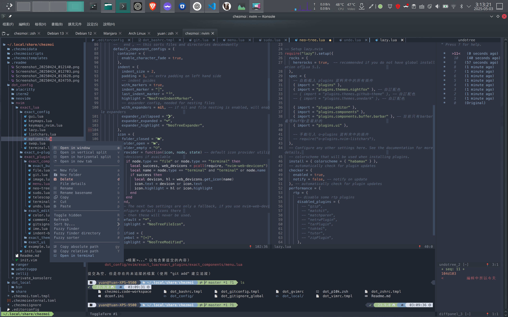

Yuan dotfile 自用環境設定檔
================================================================================
來放個調了很久的做事環境... 其實是最近有轉移多臺電腦的需求😅，想說就把我的設定整理起來，之後換電腦換機器的時候，我習慣的環境可以方便一點這樣帶著走🚗。


主要是chezmoi用來統整這些dotfiles檔案，常用作業系統是Manjaro (Arch Linux) 和 macOS，有針對這兩個作業系統調整過了，也寫好Script盡量可以一兩行指令直接懶人安裝到好。

目前比較著重在vim和zsh，有稍微調過GVim和Alacritty、Konsole設定，還有zsh和git幾個我常用的alias，也有處理過在終端機界面顯示圖片的支援（不過實際上會用到的軟體實在不多😅）。

不用期望這邊會有完整的說明啦，基本上還是自用為主，這份repo其實主要目的還是給自己方便把環境帶著走，順便把能公開的部份整理好在這邊公開，順便寫一下Readme來克服健忘症的自己😛。

（當然不能公開的密碼、主機名單...我還是有用chezmoi整理，就另外開Private Repo來放了）。

可用的作業系統環境
--------------------------------------------------------------------------------

目前已經測試過確定可用的環境組合與主要用途如下：
* macOS 15 Sequoia -主要桌面電腦工作開發用 -2025/5/2 測試過
* Manjaro Linux -主要桌面電腦工作開發用 -2025/5/2 測試過
* Debian (無GUI) -伺服器主機與Container執行環境用 -2025/5/2 測試過
* Ubuntu 24.04.2 LTS (無GUI) -雲端主機執行環境用 -2025/5/4 測試過
* Manjaro Linux (無GUI) - 2025/5/2 測試過
* Arch Linux (無GUI) -2025/5/2 測試過

都是使用一般使用者有sudo權限的帳號，目前測試直接用root帳號可能會有問題。
（尤其是Arch Linux，安裝yay無法使用root帳號）

安裝
--------------------------------------------------------------------------------
### Linux / macOS
#### 安裝主dotfiles包
若你是在以下環境，需要先做特殊處理
* <details>
      <summary>Debian Slim 精簡版作業系統，要先安裝 curl</summary>

      apt update && apt install curl -y

  </details>
* Synology 主機，需要使用特殊的安裝方式，[詳情請直接跳去看最後面](#Synology的安裝方式)


若無上述特殊環境或已經處理事先要做的事情以後，安裝整包設定擋與執行相關腳本：
```
sh -c "$(curl -fsLS get.chezmoi.io)" -- init --apply chyuaner
```

這一行指令將會把我的設定載下來複製到相對應的位置以外，還會自動安裝需要的相關軟體、套件，基本上盡量簡化到開箱即用。

這份腳本安裝時，有提供 `desktop` `server` `unroot_server` `manual` 這四種模式
* `desktop`: 一般桌機、筆電用，會安裝完整的程式，以及使用
* `server`: 伺服器用，會調成適合[伺服器用的配置](#zsh)
* `unroot_server`: 沒有root權限、不想安裝在全域系統下，所使用的模式（此模式會安裝在家目錄，而且安裝的程式版本是寫死的）
* `manual`: 完全手動，接下來會有幾個參數會問你


日後要更新的話，用這一行指令吧：

```
chezmoi update --apply
```

之後我會陸陸續續再添加我其他需求用途會調的東西，就看裝況看能不能順便整理到這裡來～ （可能之後會整理管伺服器用的輕量微調吧，這才是我想整理成懶人包的目的，把習慣帶到所有我會接觸的主機和自用雲端容器上吧）


<details>
  <summary>我自己自用的安裝方式</summary>

##### 1. 放置自己的金鑰
將 `id_rsa` sshkey金鑰檔放到 `~/.ssh/id_rsa`

##### 2. 安裝主dotfiles包
```
chezmoi init ssh://git@git.yuaner.tw:10022/yuan/dotfiles.git --apply
```

##### 3. 安裝私人用的dotfiles包
```
chezmoi init --source ~/.local/share/chezmoi-private --config ~/.config/chezmoi-private/chezmoi.toml ssh://git@git.yuaner.tw:10022/yuan/dotfiles-private.git --apply
chezmoi apply
```
</details>

#### 無root模式安裝
注意！此模式下安裝的程式版本是寫死的，不會自動更新，而且部份情況還可能需要手動處理。

通常安裝程式、套件都需要sudo這種系統管理員的權限，在比較極端情況的主機上（像是不給你sudo權限的系統帳號、沒有套件管理程式的OS），或是只想把應用程式安裝在當前使用者的情況下，可用這個模式。

雖然此模式不會用到 sudo 與 apt ,pacman, yay 這類會動到系統的程式，但是仍然會需要 git, curl 。

此模式下只會安裝最低限度需要的程式安裝在使用者家目錄裡，並由該使用者獨立執行。

#### macOS可能會遇到的狀況
##### 若無法安裝 jstkdng/programs/ueberzugpp
<https://github.com/jstkdng/homebrew-programs/issues/2>

```
$ sudo rm -rf /Library/Developer/CommandLineTools
$ xcode-select --install
```

#### 若需要刪掉重來
```
chezmoi purge
```

可能會需要刪掉相關設定
```
rm ~/.ssh/known_hosts
rm -rf ~/.vimrc ~/.vim ~/.gvimrc
rm -rf ~/.config/nvim ~/.local/share/nvim ~/.cache/nvim ~/.local/state/nvim
rm ~/.zshrc
rm -rf ~/.config/alacritty ~/.config/zellij
```

<details>
  <summary>依照chezmoi官方教學</summary>

  #### Quick start
  With chezmoi, pronounced /ʃeɪ mwa/ (shay-mwa), you can install chezmoi and your dotfiles from your GitHub dotfiles repo on a new, empty machine with asingle command:

  ```
  sh -c "$(curl -fsLS get.chezmoi.io)" -- init --apply ssh://git@git.yuaner.tw:10022/yuan/dotfiles.git
  ```

  As well as the curl | sh installation, you can install chezmoi with your favorite package manager.

  Updating your dotfiles on any machine is a single command:

  ```
  chezmoi update
  ```

  chezmoi runs on all popular operating systems, is distributed as a single statically-linked binary with no dependencies, and does not require root access.

  #### Set up a new machine with a single command

  You can install your dotfiles on new machine with a single command:

  ```
  chezmoi init --apply ssh://git@git.yuaner.tw:10022/yuan/dotfiles.git
  ```

  #### To force a refresh the downloaded archives
  use the --refresh-externals flag to chezmoi apply:

  ```
  chezmoi --refresh-externals apply
  ```

  `--refresh-externals` can be shortened to `-R`:

  ```
  chezmoi -R apply
  ```

</details>

擴充的小工具
--------------------------------------------------------------------------------
### git-pushmulti 同時上傳到多個git server
* 本體在：`~/.local/bin/git-pushmulti`

已經設定在 `.gitconfig` 裡面的alias，用法簡述：

```
git pushmulti "(origin,github)" master
```

範例中origin,github就是remote名。

PS. 因為zsh與bash的限制，一旦用到`{}`符號，會跳脫在shell層處理，進不去執行檔腳本，所以權宜之計要用 `"()"`包起來

### imgcat 直接 cat顯示圖片檔
* 本體在：`~/.local/share/chezmoi/.chezmoitemplates/common.sh.tmpl`

PS. 你的終端機程式要支援sixel，已知可用的： Konsole, iTerm2, Alacritty(非官方修改版)

```
imgcat /usr/share/wallpapers/Mountain/contents/images/1080x1920.png
```

### hex2xterm 色碼轉接近的xterm-256顏色數字編號
* 本體在：`~/.local/bin/hex2xterm`

用法範例：
```
hex2xterm "#FFFFFF"

# Output:
#    最接近的 Xterm 色碼為：231
#    Xterm RGB：#FFFFFF
```

zsh
--------------------------------------------------------------------------------
有精心整理出兩個我常用的樣式配置：日常工作電腦用、伺服器用

#### 工作電腦用
設計給自己操作用的電腦使用，以美觀最佳體驗為主。電腦上的終端機程式需要配合調整（像是需要安裝特殊字體），才會有良好的使用體驗。


* 單行設計
    * 因為一般工作電腦上已經會在桌面環境工具列放系統監控的東西，所以終端不再重複放
* 使用終端機標準的16色，但需要終端程式配合調整（不然會變成反色）
* 會使用Powerline這類的特殊字體設計


#### 伺服器用
設計給被控端使用，以實用為主（會放置監控資訊），會考量不同終端機程式的相容性

PS. 其實我本來想用雲端主機截圖當Demo，但是...IP地址不方便外流，又不想額外改圖遮掉，所以還是拿筆電當Demo了😛

* 雙行設計
* 每一步指令都會用水平線隔開，當執行的程式會大量Output時，方便回捲動時辨識用
* 只使用終端機標準的16色，不使用256色，以維持相容性
    ＊之前嘗試過256色，雖然體驗更好，但是遇到不相容環境時會完全沒色
* 不使用Powerline特殊字體，減緩在使用一般字體時的破版
* 會放置內網IP、外網IP、硬碟用量、目前網速等需要隨時知道的主機狀態
    * 不過實測發現Synology, Proxmox VE主機不支援內網IP與網速顯示功能
* bash也有[調成類似的樣式](#bash)，以便在不允許使用zsh的主機上，也仍有類似的體驗習慣

### 有用到的套件
* colorls
* eza
* sixel

### 基本快速鍵
* `alt+e`: 🪄開啟檔案總管快速鍵
* `ctrl+l`: 清空螢幕
* `ctrl+u`: 刪除一整行
* `ctrl+w`: 刪除一個單字


### zinit 套件管理程式
基本上是以zinit作為zsh主要的套件管理程式，不直接全部引入on-my-zsh，只擷取其中我會用到的部份。看看是不是有望可以兼顧到舒適和效能。

#### 更新所有套件
```
# Self update
zinit self-update

# Plugin update
zinit update
```

bash
--------------------------------------------------------------------------------
雖然我會用到的機會比較少了，幾乎都被zsh取代，但是有部份我管理的伺服器主機不允許安裝zsh，所以bash有時候還會用到，就一起調整了


以`powerbash10k`主題為基礎，但是有根據需求另外拉 `__pb10k_top` `__pb10k_bottom` 等專用func拉出來魔改。

甚至發現在 Synology系統中，沒有依賴的`tput`造成Bug，有特別針對此問題處理掉了。

neovim
--------------------------------------------------------------------------------



vim
--------------------------------------------------------------------------------


### 第一次啟動請先下以下指令

#### macOS
```
sudo ln -sfn $(brew --prefix java)/libexec/openjdk.jdk /Library/Java/JavaVirtualMachines/openjdk.jdk
vim +PlugInstall  +qall
```

#### Windows (PowerShell)
```
winget install -e GoLang.Go OpenJS.NodeJS
mkdir -p vimfiles\autoload
Invoke-WebRequest -Uri "https://raw.githubusercontent.com/junegunn/vim-plug/master/plug.vim" -OutFile "vimfiles\autoload\plug.vim"
```

Konsole
--------------------------------------------------------------------------------
會直接套用Nordic主題，搭配調好的配色使用

檔案位置：

* dot_config/private_konsolerc
* dot_local/share/konsole

Alacritty
--------------------------------------------------------------------------------

官方的程式不支援sixel在命令列直接顯示圖片，所以在Manjaro Linux中的套件安裝，是直接使用非官方修改版的AUR套件 alacritty-sixel-git 。
在macOS中，並沒有homebrew套件，建議手動[去Github Release頁面](https://github.com/ayosec/alacritty/releases/)下載dmg檔自行安裝。


因為此程式性質非常單一，重視效能而精簡，本身並沒有tab的功能。因為我的使用習慣會一直用到，所以找了純命令列又可以做到Tab功能的環境程式zellij，並將Alacritty設定成預設使用zellij開。也順便把佈景主題調好了。


chezmoi維護基本用法
--------------------------------------------------------------------------------
這是寫給自己避免忘記，還有懶人到複製貼上的小筆記。如果只是要用我的配置，這部份可以直接跳過XD

### 進入資料夾
```
chezmoi cd
```

### 加入檔案 (或從家目錄裡實際運作檔案內容更新)
```
chezmoi add ~/.zshrc
```

### 編輯檔案
```
EDITOR="code" chezmoi edit ~/.zshrc
chezmoi apply ~/.zshrc
```

將單一檔案轉換成tmpl範本
```
chezmoi add --template ~/.bashrc
chezmoi chattr +template ~/.config/iterm2/com.googlecode.iterm2.plist
```

#### 套用全部
```
chezmoi apply
```

### 開啟watchman Live Apply
```
CHEZMOI_SOURCE_PATH="$(chezmoi source-path)"
watchman watch "${CHEZMOI_SOURCE_PATH}"

watchman -j <<EOT
["trigger", "${CHEZMOI_SOURCE_PATH}", {
  "name": "chezmoi-apply",
  "command": ["chezmoi", "apply", "--force"]
}]
EOT
```

To shutdown the Watchman server, run:

```
watchman shutdown-server
```

或是清除所有的watch
```
watchman watch-del-all
```

Synology的安裝方式
--------------------------------------------------------------------------------

因為Synology 預設使用的是 sh（通常是 BusyBox 版本），不是 GNU bash，會導致普通的方式會出錯。

### 1. 安裝指令
```
sh -c "$(curl -fsLS get.chezmoi.io)" -- init --apply --exclude=scripts chyuaner
```

出現選項時，選擇 unRoot Mode （因為Synology環境很難處理軟體安裝，乾脆直接用unRoot模式）

### 2. 設定zsh為預設shell環境
```
cat << EOF > ~/.profile
if [[ -x /usr/local/bin/zsh ]]; then
export SHELL=/usr/local/bin/zsh
exec /usr/local/bin/zsh
fi
EOF
```

### 3. 手動安裝相關軟體
因為Synology環境的限制，無法自動化執行腳本。
請看 `.chezmoiscripts/run_onchange_before_linux-install-packages.sh.tmpl` 這份檔案，依照需求，手動複製執行需要的指令。

### 後續如有更新
```
chezmoi update --apply --exclude=scripts
```

若要手動看執行內容:
```
chezmoi update --apply -v --dry-run
```

相關工具參考連結
--------------------------------------------------------------------------------
* <https://www.ditig.com/256-colors-cheat-sheet>
工具官網
* <https://www.chezmoi.io/>
* <https://github.com/zdharma-continuum/zinit>
* <https://github.com/romkatv/powerlevel10k>
